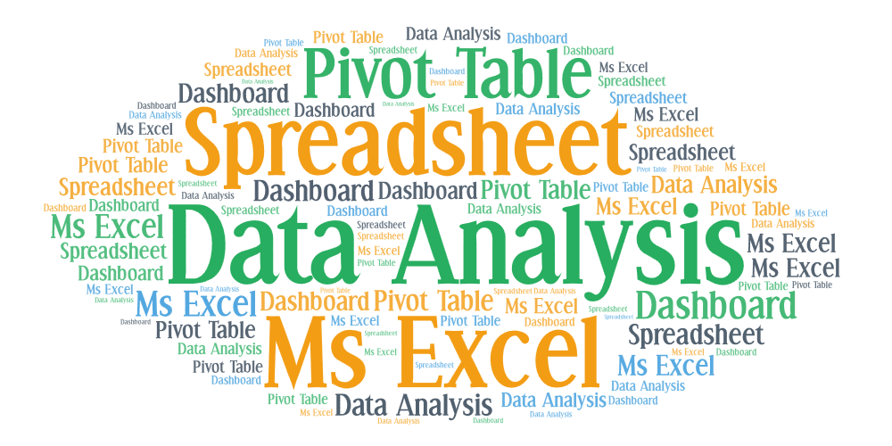

# Course: Basics of Data Analysis using Spreadsheet(BC20031)

 

 

**This course introduces foundational techniques of data analysis through spreadsheets (MS Excel/Google sheet/LibreOffice), focusing on organizing, cleaning, and interpreting data. Learners gain hands‑on skills in using formulas, charts, and tables to uncover insights from raw datasets.**

----------------------------------------------------------------------------------------------------------------------------------------------------------------------------

## 🎓 Lectures

|S.No.|Topic|Lecture Notes / Slides (PDF)|
|-|-|-|
|1.|Introduction |[Slides](#)|
|2.|XXX|[Slides](#)|
|3.|XXX|[Slides](#)|
|4.|XXX|[Slides](#)|
|5.|XXX|[Slides](#)|
|6.|XXX|[Slides](#)|
|7.|XXX|[Slides](#)|
|8.|XXX|[Slides](#)|
|9.|XXX|[Slides](#)|
|10.|XXX|[Slides](#)|

-------------------------------------------------------------------------------------------------------------------------------------------------------------------------------

## 📝 Assignments

|S.No.|Assignment Title|Description|Due Date|
|-|-|-|-|
|1.|xxx|xxx|xxx|
|2.|xxx|xxx|xxx|

-------------------------------------------------------------------------------------------------------------------------------------------------------------------------------

## 🔬 Data Sceince Lab (BC29031) Experiments

## 🔬 Lab Experiments & 📂 Datasets

## 🔬 Lab Experiments & 📂 Datasets

|S.No.|Experiment Title|Description|Week|Dataset|
|-|-|-|-|-|
|1.|Data Collection & Cleaning|Import datasets, remove duplicates, handle missing values|Week 2|[📂 Students.csv](./datasets/Students.csv)|
|2.|Exploratory Data Analysis|Use descriptive statistics and visualization to explore data|Week 3|[📂 Sales.xlsx](./datasets/Sales.xlsx)|
|3.|Data Visualization|Create charts (bar, line, scatter) using Excel/Python|Week 4|[📂 Weather|

-----------------------------------------------------------------------------------------------------------------------------------------------------------------------------

## 📚 Reading Materials

* **Textbooks**
  * *Introduction to Algorithms* – Cormen, Leiserson, Rivest, Stein
  * *Operating System Concepts* – Silberschatz, Galvin, Gagne
  * *Database System Concepts* – Silberschatz, Korth, Sudarshan
  * *Computer Networking: A Top-Down Approach* – Kurose, Ross

