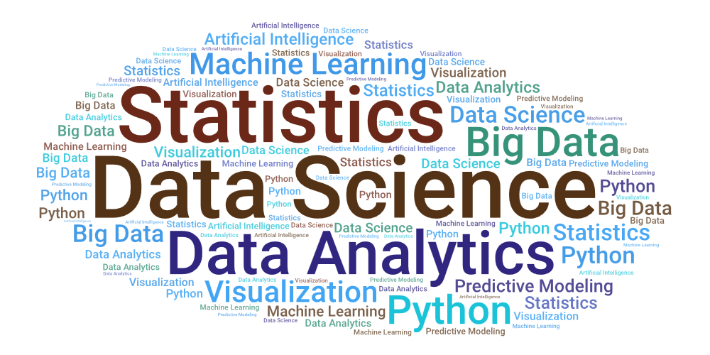

# Course: Introduction to Data Science (BC30031)

 

 

**This course introduces the fundamentals of data science, covering data collection, cleaning, visualization, and basic machine learning techniques. Learners gain practical skills to analyze real-world datasets and derive meaningful insights.**

--------------------------------------------------------------------------------

## 🎓 Lectures

|S.No.|Topic|Lecture Notes / Slides|
|-|-|-|
|1.|Introduction |[Slides](#)|
|2.|XXX|[Slides](#)|
|3.|XXX|[Slides](#)|
|4.|XXX|[Slides](#)|
|5.|XXX|[Slides](#)|
|6.|XXX|[Slides](#)|

-----------------------------------------------------------------------------------

## 📝 Assignments

|S.No.|Assignment Title|Description|Due Date|
|-|-|-|-|
|1.|Programming Basics|Write simple programs in C/Python|Week 2|
|2.|Data Structures Lab|Implement linked lists, stacks, queues|Week 4|
|3.|OS Simulation|Process scheduling simulation|Week 6|
|4.|Database Project|Create a small relational database|Week 8|
|5.|Networking Exercise|Socket programming basics|Week 10|

---

## 🔬 Lab Experiments

|S.No.|Experiment Title|Description|Week|
|-|-|-|-|
|1.|Data Collection & Cleaning|Import datasets, remove duplicates, handle missing values|Week 2|
|2.|Exploratory Data Analysis|Use descriptive statistics and visualization to explore data|Week 3|
|3.|Data Visualization|Create charts (bar, line, scatter) using Excel/Python|Week 4|
|4.|Probability & Statistics|Apply basic statistical measures (mean, variance, correlation)|Week 5|
|5.|Regression Analysis|Perform simple linear regression on sample datasets|Week 6|
|6.|Classification Basics|Implement logistic regression or decision trees|Week 7|
|7.|Clustering|Apply k-means clustering to group data points|Week 8|
|8.|Text Data Processing|Clean and analyze textual datasets|Week 9|
|9.|Time Series Analysis|Analyze trends and seasonality in time-based data|Week 10|
|10.|Capstone Lab|Combine multiple techniques to analyze a real-world dataset|Week 12|

---

## 📚 Reading Materials

* **Core Textbooks**
  * *Introduction to Algorithms* – Cormen, Leiserson, Rivest, Stein
  * *Operating System Concepts* – Silberschatz, Galvin, Gagne
  * *Database System Concepts* – Silberschatz, Korth, Sudarshan
  * *Computer Networking: A Top-Down Approach* – Kurose, Ross

* **Supplementary Resources**
  * [MIT OpenCourseWare](https://ocw.mit.edu)
  * [Harvard CS50](https://cs50.harvard.edu/x/)
  * [UC Berkeley CS61A](https://cs61a.org/)
  * [FreeTechBooks](https://www.freetechbooks.com/)

---

## 🚀 Further Exploration

| 1. | Practice |
